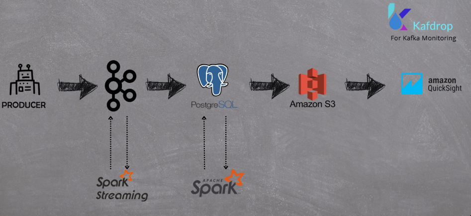
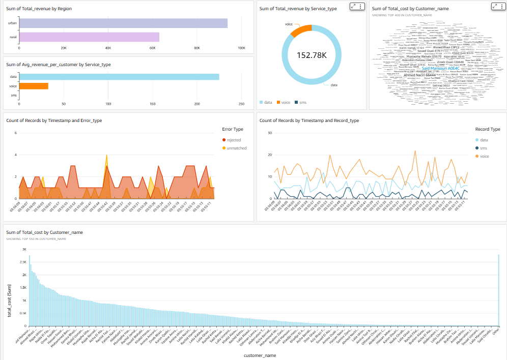

# 📡 Telecom Data Processing Pipeline

A comprehensive real-time telecom data processing pipeline built with Apache Spark, Kafka, and PostgreSQL. This system handles telecom usage records (voice, SMS, data) from generation through billing and reporting.

## Architecture Overview


The pipeline consists of six main phases:
1. **Data Generation**: Simulates telecom usage records and streams them to Kafka.
2. **Data Mediation**: Consumes records, validates, and normalizes them.
3. **Rating Engine**: Applies multi-tier pricing and calculates costs based on usage.
4. **Billing Engine**: Generates customer invoices based on rated records.
5. **Invoice Export**: Creates PDF invoices and sends them via email.
6. **Reporting**: Generates comprehensive reports and uploads them to S3.
7. **Dashboard Analytics**: Provides real-time insights into usage and revenue.


## 🚀 Features

### ✅ **Real-time Data Processing**

- **Kafka Integration**: Streaming data pipeline
- **Spark Streaming**: Real-time record processing
- **Error Handling**: Automatic dead letter queue management

### ✅ **Advanced Rating Engine**

- **Multi-tier Pricing**: Voice, SMS, and data plans
- **Time-based Pricing**: Evening/morning modifiers
- **Roaming Charges**: International call handling
- **Premium Plan Validation**: Service eligibility checks

### ✅ **Intelligent Billing**

- **Cumulative Billing**: Free unit allowances
- **Dynamic Discounts**: Student, loyalty, urban, Ramadan
- **Usage Thresholds**: Volume-based discounts
- **Tax Calculation**: VAT and regulatory fees

### ✅ **Comprehensive Reporting**

- **CSV Generation**: Local and S3 cloud storage
- **Dashboard Ready**: Time-formatted data for analytics
- **Revenue Analysis**: By region and service type
- **Error Tracking**: Dead records monitoring

### ✅ **Invoice Management**

- **PDF Generation**: Professional invoice templates
- **Email Delivery**: SMTP integration
- **Customer Analytics**: Usage patterns and billing breakdown

## 📊 Dashboard Analytics

The system provides real-time analytics dashboard with:




- **Usage Trends**: 30-second interval cost tracking
- **Revenue Analysis**: Service type and regional breakdowns
- **Customer Insights**: Activity patterns and billing summaries
- **Error Monitoring**: Dead records and system health metrics

## 📋 Prerequisites

### **System Requirements**

```bash
# Java 8 or 11
java -version

# Python 3.8+
python3 --version

# Apache Spark 3.5+
spark-submit --version

# PostgreSQL 12+
psql --version

# Apache Kafka 2.8+
kafka-topics.sh --version
```

### **Python Dependencies**

```bash
pip install pyspark==3.5.5
pip install kafka-python==2.0.2
pip install psycopg2-binary==2.9.9
pip install PyYAML==6.0.1
pip install python-dotenv==1.0.0
pip install jinja2==3.1.2
pip install weasyprint==60.0
```

## 🛠️ Installation & Setup

### **1. Database Setup**

```bash
# Connect as PostgreSQL admin
sudo -i -u postgres
psql

# Run database configuration
\i /Database/config.sql
```

### **2. Generate Test Customers**

```bash
cd /1_Data-Generation_Phase
python3 customer_generator.py
```

### **3. Environment Configuration**

```bash
# Create .env file in project root
cd /
cp .env.example .env

# Edit with your credentials
nano .env
```

### **4. Kafka Setup**

```bash
# Start Zookeeper
bin/zookeeper-server-start.sh config/zookeeper.properties

# Start Kafka
bin/kafka-server-start.sh config/server.properties

# Create topic
bin/kafka-topics.sh --create --topic telecom_usage_records \
    --bootstrap-server localhost:9092 --partitions 3 --replication-factor 1
```

## 🎮 Usage Guide

### **Phase 1: Data Generation**

```bash
cd 1_Data-Generation_Phase
python3 producer.py
```

**Output**: Real-time telecom records streamed to Kafka

### **Phase 2: Data Mediation**

```bash
cd 2_Mediation_Phase
python3 consumer_mediation.py
```

**Output**: Validated records in `normalized_records` table

### **Phase 3: Rating Engine**

```bash
cd 3_Rating-Engine_Phase

# Store normalized records
python3 consumer_rating.py

# Rate the records
python3 batch_rating.py
```

**Output**: Priced records in `rated_records` table

### **Phase 4: Billing Engine**

```bash
cd 4_Billing_Engine_Phase
python3 batch_billing.py
```

**Output**: Customer invoices in `invoices` table

### **Phase 5: Invoice Export**

```bash
cd 5_Invoice_Export_Phase
python3 invoice_generator.py
```

**Output**: PDF invoices + email delivery

### **Phase 6: Reporting**

```bash
cd 6_Reporting_Phase
python3 batch_reporting.py
```

**Output**: CSV reports + S3 upload

## 📊 Generated Reports

### **Local Folder Structure**

```
reports/
├── customers/
│   └── customers.csv
├── invoices/
│   └── invoices.csv
├── revenue/
│   ├── revenue_by_region.csv
│   └── revenue_by_service.csv
├── rated_records/
│   └── rated_records.csv
├── rate_plans/
│   └── rate_plans.csv
└── dead_records/
    └── dead_records.csv
```

### **Report Contents**

**📍 Revenue by Region**

```csv
region,total_revenue,customer_count,avg_revenue_per_customer
urban,36398.22,180,202.21
rural,15982.91,120,133.19
```

**📱 Revenue by Service**

```csv
service_type,total_revenue,total_invoices,avg_revenue_per_customer
voice,28450.75,300,94.84
sms,2140.85,300,7.14
data,21789.56,300,72.63
```

## ⚙️ Configuration

### **Database Configuration**

```yaml
# config.yaml
database:
  host: 'localhost'
  database: 'telecom_db'
  user: 'othman'
  password: 'othman'
```

### **Rate Plans**

```sql
-- Voice Plans
(1, 'Standard Plan', 'voice', 0.01, 2, NULL, NULL)  -- 0.01 MAD/sec, 2 free min
(4, 'Premium Plan', 'voice', 0.08, 4, NULL, NULL)   -- 0.08 MAD/sec, 4 free min

-- Data Plans
(3, 'Standard Plan', 'data', 0.05, 0, 10.0, 0.1)    -- Tiered pricing
(6, 'Premium Plan', 'data', 0.04, 0, 20.0, 0.08)    -- Better tiered rates
```

### **S3 Configuration**

```properties
# .env
AWS_ACCESS_KEY_ID=your_access_key
AWS_SECRET_ACCESS_KEY=your_secret_key
AWS_DEFAULT_REGION=eu-west-3
```

## 🚨 Error Handling

### **Dead Records Tracking**

- **Rating Errors**: Unmatched customers, invalid plans
- **Validation Errors**: Missing fields, negative values
- **Error Sources**: Rating engine vs. mediation engine


## 🔒 Security

### **Environment Variables**

- **Database Credentials**: Stored in `.env`
- **SMTP Settings**: Email credentials protected
- **AWS Keys**: S3 access keys secured

### **Data Validation**

- **Phone Number Validation**: Moroccan format (+212)
- **Rate Plan Validation**: Service eligibility checks
- **Customer Status**: Active customer verification

