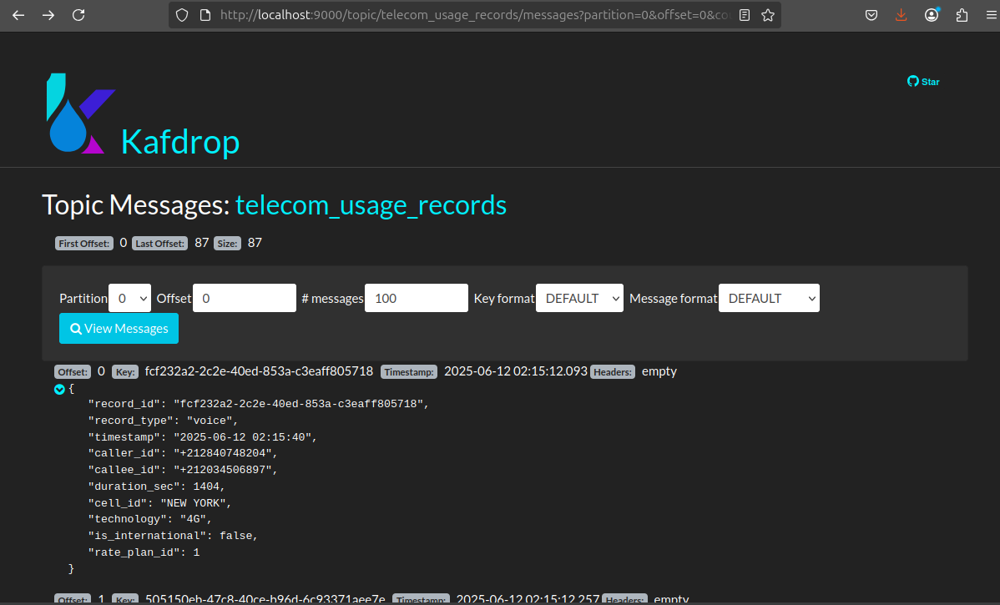

# Telecom Data Processing Pipeline

A comprehensive telecom data processing pipline (Kappa Architecture) built with Apache Spark, Kafka, and PostgreSQL. This enterprise-grade solution handles telecom usage records (voice, SMS, data) through the complete billing lifecycle from data generation to final reporting.

## Architecture Overview

This system implements a modern microservices-based architecture for telecom billing with the following components:


- **Data Generation Layer**: Simulates real-world telecom usage patterns
- **Mediation Layer**: Real-time data validation and normalization
- **Rating Engine**: Dynamic pricing and cost calculation
- **Billing Engine**: Invoice generation with complex discount logic
- **Export Layer**: PDF invoice generation and email delivery
- **Reporting Layer**: Analytics and business intelligence reports


## Key Features

### Real-time Data Processing

- **Kafka Integration**: High-throughput streaming data pipeline
- **Spark Streaming**: Distributed real-time record processing
- **Error Handling**: Comprehensive dead letter queue management
- **Scalability**: Horizontal scaling for high-volume processing

### Advanced Rating Engine

- **Multi-tier Pricing**: Flexible voice, SMS, and data plan structures
- **Time-based Pricing**: Dynamic pricing with time-of-day modifiers
- **Roaming Charges**: International call and roaming surcharge handling
- **Plan Validation**: Automatic service eligibility verification

### Intelligent Billing System

- **Cumulative Billing**: Free unit allowances with rollover logic
- **Dynamic Discounts**: Student, loyalty, geographic, and seasonal discounts
- **Usage Thresholds**: Volume-based discount tiers
- **Tax Calculation**: Automated VAT and regulatory fee computation

### Comprehensive Analytics

- **Real-time Reporting**: CSV and cloud storage integration
- **Dashboard Integration**: Time-formatted data for business intelligence
- **Revenue Analysis**: Multi-dimensional revenue breakdowns
- **Error Monitoring**: Comprehensive dead records tracking

### Invoice Management

- **Professional PDFs**: Template-based invoice generation
- **Email Integration**: Automated SMTP delivery system
- **Customer Analytics**: Detailed usage pattern analysis

## System Requirements

### Infrastructure Prerequisites

```bash
# Java Development Kit 17
java -version

# Python 3.10 or higher
python3 --version

# Apache Spark 3.5+
spark-submit --version

# PostgreSQL 12+
psql --version

# Apache Kafka 2.8+
kafka-topics.sh --version

# Docker and Docker-Compose (for monitoring)
docker --version
```

### Python Dependencies

```bash
# Install required packages
pip install -r requirements.txt

```

## Real-time Monitoring with Kafdrop

### Kafka Topics Monitoring

Monitor your Kafka topics in real-time using the Kafdrop web interface:



### Quick Start Monitoring

```bash
# Navigate to monitoring directory
cd monitoring

# Start Kafdrop container
docker-compose up -d

# Access web interface
open http://localhost:9000
```

### Monitored Topics

- **telecom_usage_records**: Raw incoming data from producers
- **normalized_records**: Validated records after mediation
- **rated_records**: Priced records ready for billing


### Stop Monitoring

```bash
# Stop Kafdrop
docker-compose down

# Clean up resources
docker system prune -f
```

## Installation and Setup

### 1. Environment Setup

```bash
# Activate Spark environment
cd /home/othman/Desktop/spark
bash Install/setup_environment.sh
```

### 2. Database Configuration

```bash
# Connect as PostgreSQL admin
sudo -i -u postgres
psql

# Run database initialization
\i /home/othman/Desktop/spark/Database/config.sql
```

### 3. Generate Test Data

```bash
cd 1_Data_Generation_Phase
python3 customer_generator.py
```

### 4. Environment Variables

```bash
# Create environment file from template
cp .env.sample .env

# Edit the .env file with your actual values
nano .env
```

**Required Configuration:**

- **AWS Credentials**: For S3 storage and uploads
- **Email Settings**: For invoice delivery notifications
- **Database**: PostgreSQL connection details
- **Kafka**: Broker configuration for streaming
- **Spark**: Memory and driver settings

**Example .env configuration:**

```bash
# AWS Configuration
AWS_ACCESS_KEY_ID=your-aws-access-key
AWS_SECRET_ACCESS_KEY=your-aws-secret-key
AWS_DEFAULT_REGION=eu-west-3

# Email Configuration
SENDER_EMAIL=your-email@gmail.com
SMTP_PASSWORD=your-app-password


```


## Pipeline Execution Guide

### Phase 1: Data Generation

```bash
cd 1_Data_Generation_Phase
python3 producer.py
```

**Output**: Real-time telecom records streamed to Kafka topics

### Phase 2: Data Mediation

```bash
cd 2_Mediation_Phase
python3 consumer_mediation.py
```

**Output**: Validated and normalized records stored in database

### Phase 3: Rating Engine

```bash
cd 3_Rating_Engine_Phase

# Store normalized records from Kafka
python3 consumer_rating.py

# Apply pricing rules and calculate costs
python3 batch_rating.py
```

**Output**: Priced records with cost calculations in `rated_records` table

### Phase 4: Billing Engine

```bash
cd 4_Billing_Engine_Phase
python3 batch_billing.py
```

**Output**: Customer invoices with discounts and taxes in `invoices` table

### Phase 5: Invoice Export

```bash
cd 5_Invoice_Export_Phase
python3 invoice_generator.py
```

**Output**: Professional PDF invoices with automated email delivery

### Phase 6: Reporting and Analytics

```bash
cd 6_Reporting_Phase
python3 batch_reporting.py
```

**Output**: Business intelligence reports exported to CSV , S3 to do analytics and dashboard integration using Amazon QuickSight


## Generated Reports and Analytics

### Local Report Structure

```
reports/
├── customers/
│   └── customers.csv
├── invoices/
│   └── invoices.csv
├── revenue/
│   ├── revenue_by_region.csv
│   └── revenue_by_service.csv
├── rated_records/
│   └── rated_records.csv
├── rate_plans/
│   └── rate_plans.csv
└── dead_records/
    └── dead_records.csv
```

### Sample Report Contents

**Revenue by Region**

```csv
region,total_revenue,customer_count,avg_revenue_per_customer
urban,36398.22,180,202.21
rural,15982.91,120,133.19
```

**Revenue by Service Type**

```csv
service_type,total_revenue,total_invoices,avg_revenue_per_customer
voice,28450.75,300,94.84
sms,2140.85,300,7.14
data,21789.56,300,72.63
```

**Rated Records (Dashboard Ready)**

```csv
record_id,record_type,timestamp,msisdn,cost,rating_status
abc-123,voice,04:07:48,+212600000001,15.75,rated
def-456,data,04:08:15,+212600000002,25.50,rated
```

## Configuration Management

### Database Configuration

```yaml
# config.yaml
database:
  host: 'localhost'
  database: 'telecom_db'
  user: 'othman'
  password: 'othman'
```

### Rate Plan Configuration

```sql
-- Voice Plans
(1, 'Standard Plan', 'voice', 0.01, 2, NULL, NULL)  -- 0.01 MAD/sec, 2 free min
(4, 'Premium Plan', 'voice', 0.08, 4, NULL, NULL)   -- 0.08 MAD/sec, 4 free min

-- Data Plans
(3, 'Standard Plan', 'data', 0.05, 0, 10.0, 0.1)    -- Tiered pricing
(6, 'Premium Plan', 'data', 0.04, 0, 20.0, 0.08)    -- Better tiered rates
```

## Advanced Features

### Dynamic Discount System

- **Student Discount**: 15% reduction for verified students
- **Loyalty Program**: 2% per year of service (maximum 10%)
- **Geographic Pricing**: 5% discount for urban area customers
- **Seasonal Promotions**: 10% discount during Ramadan month
- **Volume Incentives**: Usage threshold-based discount tiers

### Time-based Pricing Engine

- **Morning Rates**: 2% discount during 8 AM - 12 PM for voice services
- **Evening Surcharge**: 2% premium during 6 PM - 11 PM for voice services
- **Weekend Pricing**: 3% Friday discount for voice communications

### International Service Management

- **Premium Plan Requirements**: International calls and SMS restricted to premium plans
- **Roaming Charges**: 50% surcharge for all roaming services
- **Service Blocking**: Automatic rejection for non-eligible plans

## Dashboard Integration (Amazon QuickSight)


  

## Error Handling and Monitoring

### Dead Records Tracking

- **Rating Errors**: Unmatched customers, invalid plans
- **Validation Errors**: Missing fields, negative values
- **Error Sources**: Rating engine vs. mediation engine


